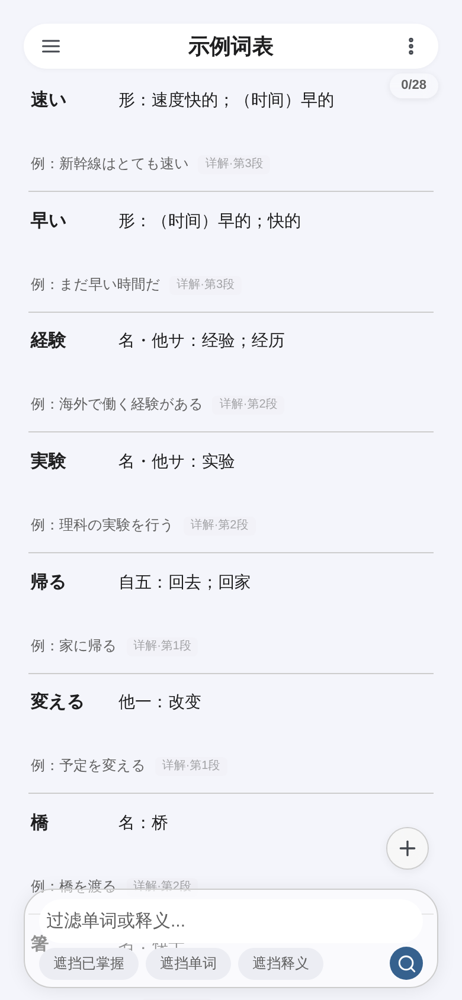
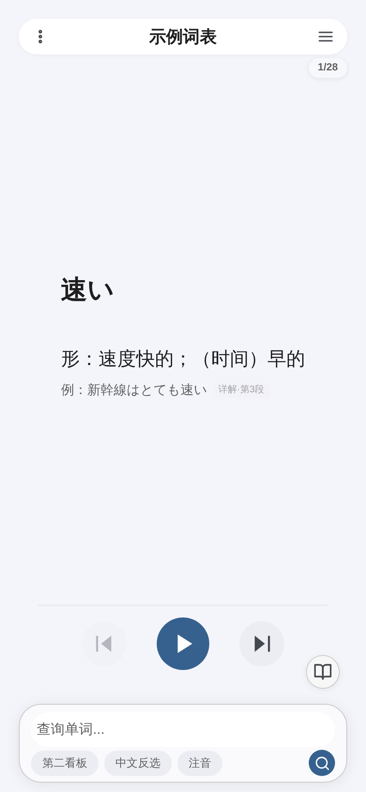
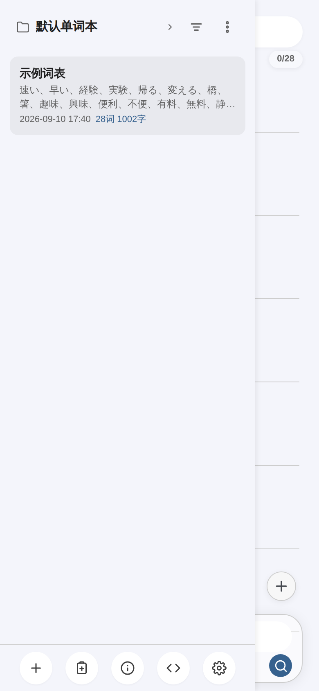
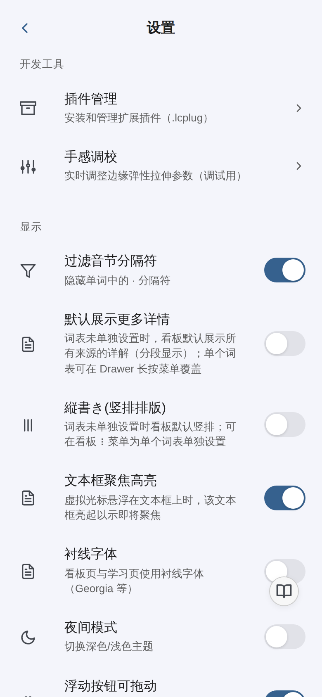

  
  <h1>LexiCull</h1>
  
<b>打造易用可靠的个人辞书应用</b>

  
不止于背单词 —— 收录、整理、比对、回顾你的专属词库

  

    <a href="https://github.com/ranjiushu/LexiCull-Releases/releases/latest"><b>下载最新版</b></a>
    &nbsp;·&nbsp;
    <a href="https://github.com/ranjiushu/LexiCull-Releases/releases">更新历史</a>
    &nbsp;·&nbsp;
    <a href="https://github.com/ranjiushu/LexiCull-Releases/issues">问题反馈</a>
  

  
Android 7.0 及以上 · 词库数据全部保存在本机 · 无需注册账号

---

## 下载

最新版本：**v1.0 build 2717**（2026-09-10）

| 项目 | 内容 |
|---|---|
| 安装包 | `LexiCull-v1.0-b2717.apk`（1.18 MB） |
| 直接下载 | [LexiCull-v1.0-b2717.apk](https://github.com/ranjiushu/LexiCull-Releases/releases/download/v1.0-b2717/LexiCull-v1.0-b2717.apk) |
| 全部版本 | [Releases](https://github.com/ranjiushu/LexiCull-Releases/releases) |
| SHA-256 | `5787bfd20379479818071d534e92c45517c5f5fbc327a4ac43b069af50a6bfec` |

**安装步骤**

1. 下载 APK 到手机；
2. 系统提示时允许「安装未知来源应用」；
3. 安装并打开，首次启动即为 **30 天全功能试用**，无需注册或登录。

> 安装包为纯 WebView 壳、不含原生库，所有机型（arm64 / armv7 / x86）通用。

## 界面

  
  
  
  

看板（词典印刷风格排版） · 学习页 · 辞书抽屉 · 设置页

## 这是什么

LexiCull 是一个**纯离线的个人辞书应用**。它把「收词 → 整理 → 比对 → 回顾」做成一条完整链路：你 feeds 给它任意文本，它解析成结构化辞条并排成一本可以长期翻阅的辞书；而不是只给你一个背单词的进度条。

适合：日语等外语的例句/生词积累、读书笔记里的术语收藏、任何需要「按自己的方式整理词条」的场景。

## 核心功能

**一键收录，自动整理**
通过 Morph FAB 粘贴任意文本，智能解析、去重合并、统一格式，形近词自动相邻排列，即刻呈现在词典印刷风格的看板中。

**对比式、归纳式学习**
第二看板与底栏过滤功能帮助你快速筛选、并排审视相近辞条差异，在对比中深化理解；学习页提供筛查（自评）与背诵（自动播放）两种模式。

**精准编辑，细致入微**
移动光标与文本框高亮让你精确定位每一个字段；详解列表亦可一键切至编辑模式，就地修改。支持拖拽排序、振假名注音、竖排文本。

**放心收录，大胆操作**
多后端备份（本地 / WebDAV / 阿里云盘）与历史记录让你随时回退每一步改动 —— 收录、编辑、重排，无需顾虑。

**插件系统**
开放四层 API（只读查询 → 变换管道 → 用户数据读写 → UI 钩子），支持 `.lcplug` 格式导入，内置格式整理等实用插件。

**细节打磨**
取景器并排审视、快照对比、弹性滚动、呼吸式光标、音量键翻页、夜间模式、衬线字体 …… 蕴繁于简。

## 数据与隐私

- **词库、学习进度、设置全部保存在你的设备上**，不上传服务器；
- 联网只用于获取授权许可，不传输任何词条内容；
- 备份出口：本地文件、WebDAV、阿里云盘、ZIP 导出（可随时完整导出为通用 CSV）。

## 授权与试用

- 首次安装起 **30 天全功能试用**，试用期内完全静默，不弹任何授权提示；
- 试用到期后自动**联网获取许可**即可继续使用，对正常用户无感；
- 长期离线或许可到期时会进入**只读模式**：仍可浏览、检索、导出备份，**数据不会被锁死或删除**，恢复联网后即可回到正常使用。

本应用为个人开发者的独立作品，当前为 **β 测试版**，欢迎通过 [Issues](https://github.com/ranjiushu/LexiCull-Releases/issues) 反馈问题与建议。

## 常见问题

**Q：安装时提示「解析包错误」或「应用未安装」？**
需要 Android 7.0（API 24）及以上；请确认下载的是完整安装包（对照上方 SHA-256）。

**Q：为什么提示「安装未知来源应用」？**
本应用不在应用商店分发，直接安装 APK 需要授权该来源。安装完成后可以关闭该授权。

**Q：需要注册账号或登录吗？**
不需要。没有账号体系，安装即用。

**Q：换手机 / 重装后怎么迁移数据？**
在旧设备的「设置 → 备份」导出 ZIP 或上传 WebDAV，在新设备导入即可；词库与学习进度都会一并恢复。

**Q：为什么界面变成只读，编辑按钮不响应？**
试用到期且未能联网获取许可。连接网络后重启应用即可恢复正常；数据始终完整保留。

**Q：词库内容会被上传吗？**
不会。词条、释义、笔记都只存在于本机与你主动配置的备份位置。

**Q：其他渠道下载的安装包能用吗？**
本仓库是唯一的官方分发渠道。其他来源的安装包可能被修改，不建议安装。

## 使用条款

- 免费供个人使用；
- 禁止反编译、二次打包、修改后分发，以及任何形式的商业使用或再分发；
- 版权归作者所有。

## 关于本仓库

本仓库**只托管项目简介、界面截图与官方安装包，不包含源代码**（源码为私有仓库）。版本说明与安装包更新见 [Releases](https://github.com/ranjiushu/LexiCull-Releases/releases)。
