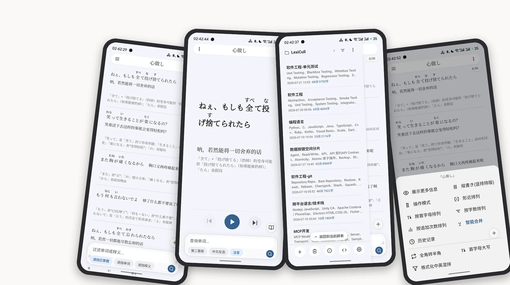
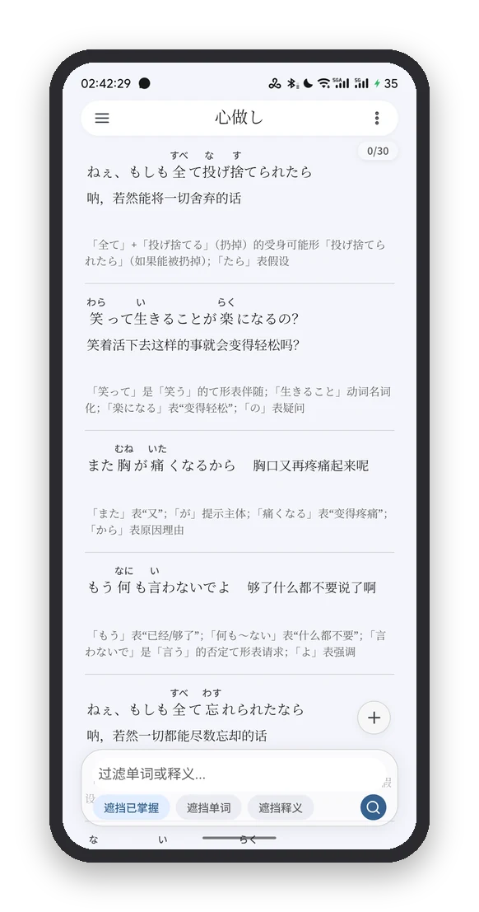
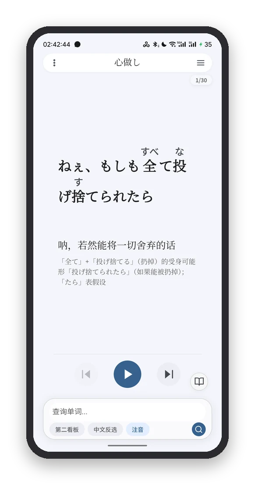
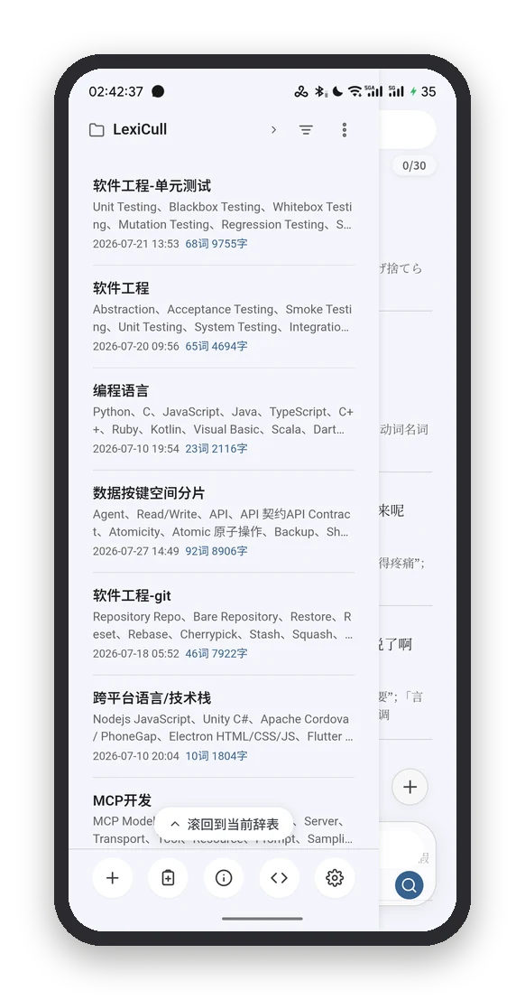
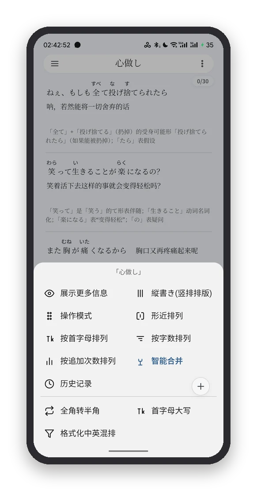

<div align="center">
  
  <h1>LexiCull</h1>
  <p><b>打造易用可靠的个人辞书应用</b></p>
  <p>收录、整理、比对、回顾你的专属词库。背单词只是其中一环。</p>
  <p>
    <a href="https://ranjiushu.github.io/LexiCull-Releases/"><b>官网</b></a>
    &nbsp;·&nbsp;
    <a href="https://github.com/ranjiushu/LexiCull-Releases/releases/latest">下载最新版</a>
    &nbsp;·&nbsp;
    <a href="https://github.com/ranjiushu/LexiCull-Releases/releases">更新历史</a>
    &nbsp;·&nbsp;
    <a href="https://github.com/ranjiushu/LexiCull-Releases/issues">问题反馈</a>
  </p>
  <p><sub>Android 7.0 及以上 · 词库数据全部保存在本机 · 无需注册账号</sub></p>
</div>

<p align="center">
  
</p>
<p align="center"><sub>看板 · 背诵 · 筛查（真机截图，词表为技术名词）</sub></p>

## 下载

最新版本：**v1.0 build 2717**（2026-09-10）

| 项目 | 内容 |
|---|---|
| 安装包 | `LexiCull-v1.0-b2717.apk`（1.18 MB） |
| 直接下载 | [LexiCull-v1.0-b2717.apk](https://github.com/ranjiushu/LexiCull-Releases/releases/download/v1.0-b2717/LexiCull-v1.0-b2717.apk) |
| 固定链接 | [releases/latest/download/LexiCull.apk](https://github.com/ranjiushu/LexiCull-Releases/releases/latest/download/LexiCull.apk)（始终指向最新版，与上面的包内容相同） |
| 全部版本 | [Releases](https://github.com/ranjiushu/LexiCull-Releases/releases) |
| SHA-256 | `5787bfd20379479818071d534e92c45517c5f5fbc327a4ac43b069af50a6bfec` |

**安装步骤**

1. 下载 APK 到手机；
2. 系统提示时允许「安装未知来源应用」；
3. 安装并打开，首次启动即为 **30 天全功能试用**，无需注册或登录。

> 安装包不含原生库，所有机型（arm64 / armv7 / x86）通用。

## 这是什么

打造易用可靠的**个人辞书应用**：收录、整理、比对、回顾你的专属词库。背单词只是其中一环。

它还原纸质辞书的排版与翻阅体验 —— 词典印刷风格的看板、词条级别的精准编辑、形近词自动相邻排列，并支持 Android 与 Web 双端使用。

## Q&A

**和 Notion、Obsidian 是什么关系？**

他们以文档作为信息载体，LexiCull 以词条作为信息载体，便于个人维护和检索。

**和百词斩、anki 是什么关系？**

他们做的是固定课程和遗忘曲线那一套。LexiCull 专注于检索和筛查，可以导入单词，也可以导入技术名词 —— 做外贸、啃论文，任何专门领域的术语都能拿来管理。把熟悉的筛掉，集中攻克不熟悉的知识才有效率。

**我干嘛费劲维护一个个人辞条呢？**

也不是所有词条都得手敲，用 LLM 一键生成才是推荐的做法。词条这种结构还有个好处：LLM 的输出有错，逐条审视、核对、修正都方便。LexiCull 为筛查、检索和记忆服务，同时允许 Agent 通过 MCP 读取你的辞条：可以迅速检索并复制某个技术名词以精确与 LLM 沟通，本地 Agent 也可读取你的个人知识储备，更高效地协作工作。

**那我用指针加文档不是也可以达到同样的效果？**

个人场景文档维护成本高（大部分人根本不会亲手维护文档，LLM 全量吞吐之后文档会逐渐失真），手动检索也不方便，而且自己很容易读不下去。LexiCull 的辞条场景下，能够让你专注地阅读数万字的陌生领域的知识。

**说这么多，那具体怎么使用呢？**

想象你搞到一篇硬核的技术论文，里面充斥着大量你从来没见过的技术名词，你就可以把它扔给多个不同的 LLM 让它们总结核心概念，按照这种结构输出：

```
[名词/概念]-[顾名思义]-[详细解释]-[音标/读法]
```

LexiCull 可以一键导入、合并追加。你可以阅读最精简的释义，观察哪些概念被多次合并 —— 这可能就意味着统计意义上的重要；看到不同的解释，也可以建立更立体的认识。

## 和其他方式的对比

Obsidian 这类长文档知识库，个人场景下维护成本高，长期坚持写、回头读的人不多；检索链路长；交给 Agent 反复全文吞吐，次数越多，信息损耗越大。

市面上的词典大多提供给定的词表，考学场景占主流，难以满足个人聚焦某个专门领域的辞书需求。而相对严肃的学习离不开辞书；用 Excel 之类的工具管理这些知识不够便利，此前这类需求多由笔记软件代劳。

经典的记忆曲线研究多以无意义材料为对象，直接套用到知识学习上未必合适。LexiCull 不搞记忆曲线：某些知识你看完、筛查完，感觉差不多就得了；下次遇到时再筛再记，比每天被提醒着复习十几个名词实在。

## 功能一览

**看板**：力求还原印刷制品的质感

**筛查**：十选一，迅速判断是否熟悉掌握

**背诵**：可以逐条聚焦精读，减少干扰

**遮挡**：3 种遮挡模式，模仿马克笔覆盖效果协助记忆

**Drawer 栏**：通过手指滑动呼出，切换辞表

**第二看板**：打开后与第一看板通过**左右滑动切换**，方便对比

**移动光标**：编辑看板时通过摇杆精准控制光标

**呼吸式光标**：自定义光标动画，更沉浸美观

**WebDAV 备份**：词条数据私有，不上传 LexiCull 服务器

**掌握历史**：智能「Git」你的掌握历史，随时回滚与回顾

**形近排列**：将「长得像」的辞条放在一起，方便对比记忆与手动去重（去重采用保守算法，因为防假阳性更难接受）

**线索式检索**：通过空格隔离关键词，同时检索所有关键词（线索），按相关性排序

**Morph FAB**：通过「上下文」感知实现多个页面的模式切换

**万能底栏**：底栏通过「上下文」智能切换功能 —— 检索、过滤、光标、跳转、撤销……

**不止于此。**

## 上手：三步把文章变成词库

**第一步**：把文章连同下面这段提示词一起发给任意 AI（DeepSeek、ChatGPT 等）：

```
请把这篇文章拆解为可导入 LexiCull 的 CSV（每行一条辞条，4 列，逗号或 Tab 分隔）：
1. 辞条：单词、概念、术语，可高度抽象概括
2. 释义：简洁易懂的解释，可省略次要信息
3. 详解：更详细的解释，允许适度冗余；多个独立部分之间用 |||（三个管道符）分隔
4. 补充：读音、标签等补充信息，可有可无，留空不影响理解
直接输出 CSV，不要多余解释。
```

**第二步**：复制 AI 输出的 CSV，回到 App 点「粘贴文本，智能收录」，自动拆成辞条。

**第三步**：筛查 —— 熟悉的筛掉，生疏的使劲背。

（App 内引导弹窗提供同一份提示词与一键复制；也可以点「载入示例词表」先看看成品长什么样。）

## 界面

<p align="center">
  
  
  
  
</p>
<p align="center"><sub>看板（词典印刷风格排版） · 背诵页 · 辞表抽屉 · 看板菜单</sub></p>

## 数据与隐私

- **词库、学习进度、设置全部保存在你的设备上**，不上传服务器；
- 联网只做两件事：获取许可、检查远程公告（版本更新与重要通知）；不传输任何词条内容，也不收集使用数据；
- 备份出口：本地文件、WebDAV、阿里云盘、ZIP 导出（可随时完整导出为通用 CSV）；
- Agent 通过 MCP 读取辞条的能力由你自行开启，默认关闭。

## 联网许可要求

- 首次安装起 **30 天全功能试用**，试用期内完全静默，不弹任何提示；
- 试用到期后自动**联网获取许可**即可继续使用，对正常用户无感；
- 长期离线或许可到期时会进入**只读模式**：仍可浏览、检索、导出备份，**数据不会被锁死或删除**，恢复联网后即可回到正常使用。

当前为 **β 测试版**，欢迎通过 [Issues](https://github.com/ranjiushu/LexiCull-Releases/issues) 反馈问题与建议。

## 安装与常见问题

**Q：安装时提示「解析包错误」或「应用未安装」？**
需要 Android 7.0（API 24）及以上；请确认下载的是完整安装包（对照上方 SHA-256）。

**Q：为什么提示「安装未知来源应用」？**
本应用不在应用商店分发，直接安装 APK 需要授权该来源。安装完成后可以关闭该授权。

**Q：需要注册账号或登录吗？**
不需要。没有账号体系，安装即用。

**Q：换手机 / 重装后怎么迁移数据？**
在旧设备的「设置 → 备份」导出 ZIP 或上传 WebDAV，在新设备导入即可；词库与学习进度都会一并恢复。

**Q：为什么界面变成只读，编辑按钮不响应？**
试用到期且未能联网获取许可。连接网络后重启应用即可恢复正常；数据始终完整保留。

**Q：词库内容会被上传吗？**
不会。词条、释义、笔记都只存在于本机，以及你主动配置的备份位置。

**Q：其他渠道下载的安装包能用吗？**
本仓库是唯一的官方分发渠道。其他来源的安装包可能被修改，不建议安装。

## 使用条款

- 免费供个人使用；
- 禁止反编译、二次打包、修改后分发，以及任何形式的商业使用或再分发；
- 版权归作者所有。

## 关于

**开发者**：冉旧舒（Ranjiushu）· 3434753018@qq.com

本仓库**只托管项目简介、界面截图与官方安装包，不包含源代码**（源码为私有仓库）。版本说明与安装包更新见 [Releases](https://github.com/ranjiushu/LexiCull-Releases/releases)。
